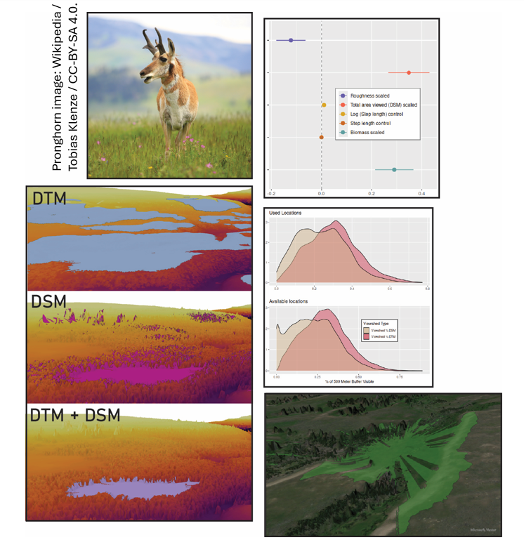

## Selected projects and examples

  
Habitat Selection across Scales, Montana Pronghorn in Winter

  
  Using 700 individually collared animals
  

  
Mechanistic Explanations of Facultative Movements using Simulations From ISSA

  
  Using 700 individually collared animals
  

  
Connectivity Modeling in the GYE

  
  Using 700 individually collared animals
  

  
Novel Drone Based Biodiversity Monitoring in Amazonas, Brazil

  
  Using 700 individually collared animals
  

  
Field Based Biodiversity Monitoring and Biogeography in the Uatumã Preserve, Brazil

  
  Using 700 individually collared animals
  

  
Assisting with ESA-Listed Arctic Sea Duck Recovery in Utqiagvik, AK

  
  Using 700 individually collared animals
  

  
Assisting with Bighorn Sheep Nutrition and Behavior Research in Wyoming

  
  Using 700 individually collared animals
  

  
Integrating Remote Sensing into Field Based Monintoring in Powderhorn Wilderness, Colorado

  
  Using 700 individually collared animals
  

  
Assisting with Golden Eagle Nestling Toxicology and Diet Fieldwork

  
  Using 700 individually collared animals
  

  
Incorporating DTM and DSM into Viewsheds for Behavior Analysis 

  
  
  Use the function and view the code [here.](https://github.com/jskelly1/ground.predator.viewshed)
  

## Personal projects and fun...

  
Creating Physical 3D Models with DEM and 3D Printers

  
  Using 700 individually collared animals
  

  
250+ User Texas A and M Job Board List Serve Email Alert Bot
  
  
| Word | Title | Url |
|---|---|---|
| Montana | range wildlife biologist | https://jobs.rwfm.tamu.edu/view-job/?id=103047 |
| Montana | wildlife management biologist |  biologist	https://jobs.rwfm.tamu.edu/view-job/?id=103052 |

Currently, I maintain a 250+ person job board list serve that sends daily emails based on custom keywords found in new Texas A and M Job Board posts. Natural resource jobs are competitive and applying and searching for jobs is not conducive to those who have less time to monitor the website daily. Instead, I hope this tool can improve accessibility to job applying.

The script is hosted on pythonanywhere. [Click to sign up!](https://docs.google.com/forms/d/e/1FAIpQLSfr7xaa9CCVFrVngGTUppUB428WgkTQthqb51d7XWEf6Fyzgg/viewform) and [remove yourself here.](https://jaydenskelly.pythonanywhere.com/)

Code is available [here.](https://github.com/jskelly1/TAMU_bot/blob/main/emailalert.py)
  

